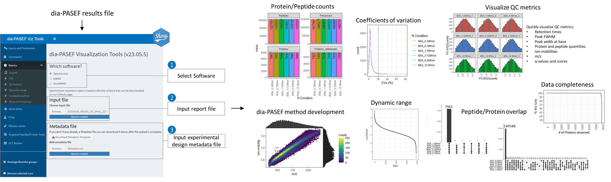

---
---
---

# dia-PASEF visualization tool

The **dia-PASEF Visualization Tool** App is a [Shiny App](https://www.rstudio.com/products/shiny/) that helps to quickly inspect the results of dia-PASEF. This app is a user-friendly tool designed to streamline the process of exploring and visualizing dia-PASEF results. The app uses the reports from common software tools, [DIA-NN](https://github.com/vdemichev/DiaNN), [Spectronaut](https://biognosys.com/software/spectronaut/) and [tims DIA-NN](https://www.bruker.com/en/products-and-solutions/mass-spectrometry/ms-software/paser.html), and offers a user-friendly interface and a variety of interactive charts and graphs to help users better understand their data.



## Features

-   **Load DIA data**: The app allows users to upload their dia-PASEF data analysis result reports from DIA-NN, Spectronaut or TIMS DIA-NN. The experimental design can be entered with a metadata file.

-   **Interactive data exploration**: Users can explore the dia-PASEF data through an interactive user-interface that enables the creation of multiple visualizations without needing to code. The visualizations include peptide\\protein count plots, coefficients of variation plots, protein abundance dynamic range, upset plots, ion-mobility -m/z heatmaps, QC metric distributions and correlation plots, among others. The users can dynamically select sample conditions, adjust plot parameters, and filter data to focus on specific subsets of data of interest. Having access to quick data visualization can make it easier to identify patterns, trends, and relationships that may not be immediately apparent from raw data. Clear and concise data representation accelerates decision-making and help QC instrument performance. The dia-PASEF Visualization Tool can save time and resources by allowing users to quickly identify areas of interest and make informed decisions without having to manually sift through large amounts of raw data.

-   **Export and sharing**: The app allows users to export reports and visualizations.

## Getting Started

To run the dia-PASEF Visualization Tool App locally, follow these steps:

### Installation

<details>

<summary>Installation</summary>

1.  **Install R**: Make sure you have R installed on your system. You can download it from the official R project website (<https://www.r-project.org>).

2.  **Install required packages**: Open the R console or an integrated development environment (IDE) and install the required R packages by executing the following commands:

``` r
if (!require("BiocManager", quietly = TRUE))
  install.packages("BiocManager")
if(!require("cmapR", quietly = T)) {BiocManager::install("cmapR")}


if(!require("shinydashboard", quietly = T)) {install.packages("shinydashboard")}
if(!require("tidyverse", quietly = T)) {install.packages("tidyverse")}
if(!require("cowplot", quietly = T)) {install.packages("cowplot")}
if(!require("UpSetR", quietly = T)) {install.packages("UpSetR")}
if(!require("plotly", quietly = T)) {install.packages("plotly")}
if(!require("shinyWidgets", quietly = T)) {install.packages("shinyWidgets")}
if(!require("ggrepel", quietly = T)) {install.packages("ggrepel")}
if(!require("heatmaply", quietly = T)) {install.packages("heatmaply")}
if(!require("shinyShortcut", quietly = T)) {install.packages("shinyShortcut")}
if(!require("testthat", quietly = T)) {install.packages("testthat")}
if(!require("colourvalues", quietly = T)) {install.packages("colourvalues")}
if(!require("shinycssloaders", quietly = T)) {install.packages("shinycssloaders")}
if(!require("GGally", quietly = T)) {install.packages("GGally")}
if(!require("shinyjs", quietly = T)) {install.packages("shinyjs")}
if(!require("FactoMineR", quietly = T)) {install.packages("FactoMineR")}
```

3.  **Download the app**: Clone or download the repository containing the Shiny app code from the GitHub repository <https://github.com/sebastian-vaca/diaPASEF_Viz_Tool>

4.  **Run the app**: Navigate to the downloaded app directory and open the R console or IDE. Load the Shiny library and run the app using the following command:

``` r
library(shiny)
runApp()
```

5.  **Access the app**: After running the above command, the Shiny app will start running locally. Open your web browser and visit the URL displayed in the R console to access the app.

</details>

### Input file format

-   DIA-NN and TIMS DIA-NN: The input is the main report (.tsv file that does not have any suffix). This file is a long format file. The app does not recognize the matrix files. This file is easy to identify, it is usually the largest file created by DIA-NN or TIMS DIA-NN.

-   Spectronaut: Please export the report using the template found [here](Spectronaut_report_template/).

### Tutorial

Instructions on how to use the app can be found [here](tutorial/).

## Example data sets

1.  The example data set was taken form the work of [Oliinyk et al. Proteomics, 2023](https://analyticalsciencejournals.onlinelibrary.wiley.com/doi/full/10.1002/pmic.202200032) ([ProteomeXchange](http://www.proteomexchange.org/) consortium ID: [PDX033904](https://www.ebi.ac.uk/pride/archive/projects/PXD033904)). The data can be found here.

2.  The second example data set consists of BSA peptides spiked in a human digest (Promega K562) to create a dilution series sample set, ranging in peptide concentrations from 380 amol to 12.5 fmol. The data was acquired on a Bruker timsTOF HT coupled to an EvoSep (30SPD). The data can be found here.

A poster summarizing the results of these two data sets was presented at [ASMS Houston 2023](https://www.asms.org/conferences/annual-conference/annual-conference-homepage), and is available upon request.

## Dependencies

The dia-PASEF Visualization Tool App relies on the following R packages:

<details>

<summary>dependencies</summary>

-   **tidyverse**: A collection of R packages for data manipulation, visualization, and analysis, providing a consistent and powerful set of tools.

-   **cowplot**: An R package for creating complex plots by combining multiple plots into a single plot grid with customized annotations and themes.

-   **UpSetR**: A package for visualizing and exploring complex intersections and sets of elements using UpSet plots.

-   **plotly**: An interactive plotting package in R that creates highly customizable, web-based graphs and visualizations.

-   **shinyWidgets**: Provides a set of user-friendly, customizable widgets and inputs for creating interactive Shiny applications.

-   **ggrepel**: A package that adds text labels to ggplot2 plots with intelligent label repulsion, making it easier to visualize data without overlapping labels.

-   **heatmaply**: Offers an interactive heatmap visualization tool for exploring and analyzing high-dimensional datasets.

-   **shinyShortcut**: Simplifies the creation of Shiny applications by providing a set of shortcut functions for common tasks and UI elements.

-   **testthat**: An R package for unit testing that makes it easy to write and run tests for R code and packages.

-   **colourvalues**: Provides a collection of color palettes and utility functions for working with colors in R.

-   **shinycssloaders**: Adds loading animations and spinners to Shiny applications to enhance the user experience during data loading or computation.

-   **GGally**: Extends the functionality of ggplot2 with additional statistical visualizations, matrix plots, and groupwise comparisons.

-   **shinyjs**: Allows for easy integration of JavaScript functions and code into Shiny applications to enhance interactivity and customization.

</details>

All the necessary dependencies will be automatically installed when following the "Getting Started" instructions.

## Contribution

The community and package authors are invited to contribute to the package. If you have or know of a package of interest, please [fork](https://help.github.com/articles/fork-a-repo) the repository ([https://github.com/sebastian-vaca/diaPASEF_Viz_Tool](https://github.com/sebastian-vaca/XXXXXXXXXX)) and a new section to the vignette and send a [pull request](https://help.github.com/articles/creating-a-pull-request).

## Disclaimer

The application presented in this GitHub repository is a personal project created by Sebastian Vaca. Please note that this application is not affiliated with or supported by Bruker.

While I have made efforts to develop and test the application to the best of my abilities, I cannot guarantee its functionality, reliability, or suitability for any specific purpose. The application is provided on an "as-is" basis, and I assume no responsibility for any errors, bugs, or issues that may arise from its usage.

Furthermore, please be aware that I created this application independently and it does not fall under the scope of my responsibilities at Bruker. As a result, any inquiries, bug reports, or feature requests related to this application should not be directed to Bruker.

Please use the application at your own discretion and risk. I recommend thoroughly reviewing the code, documentation, and any associated licenses before using or modifying the application. Additionally, exercise caution when deploying the application in production environments, as it may not have undergone the same level of testing and security scrutiny as officially supported software.

If you encounter any issues or have questions about the application, I encourage you to seek assistance from the open-source community or consult the relevant documentation provided within the repository.

Thank you for your understanding and for taking note of this disclaimer.
